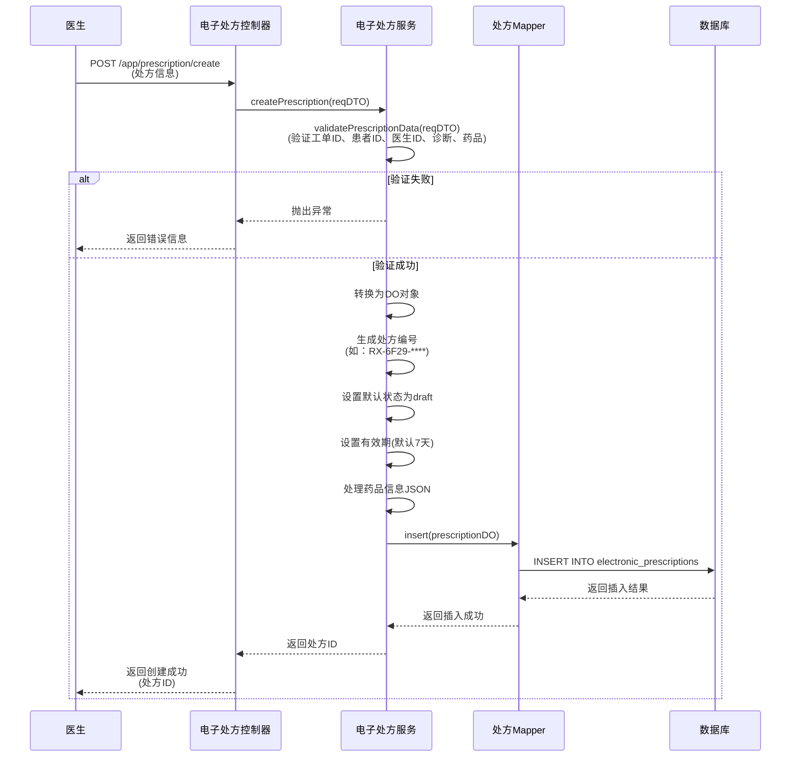
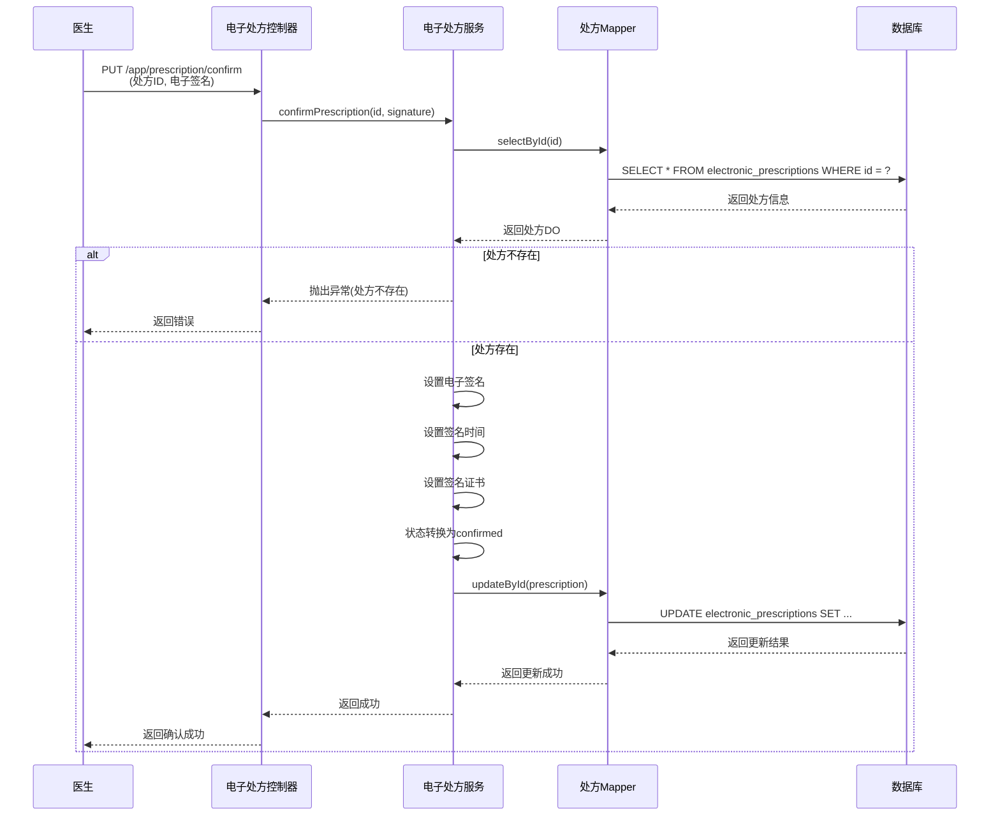
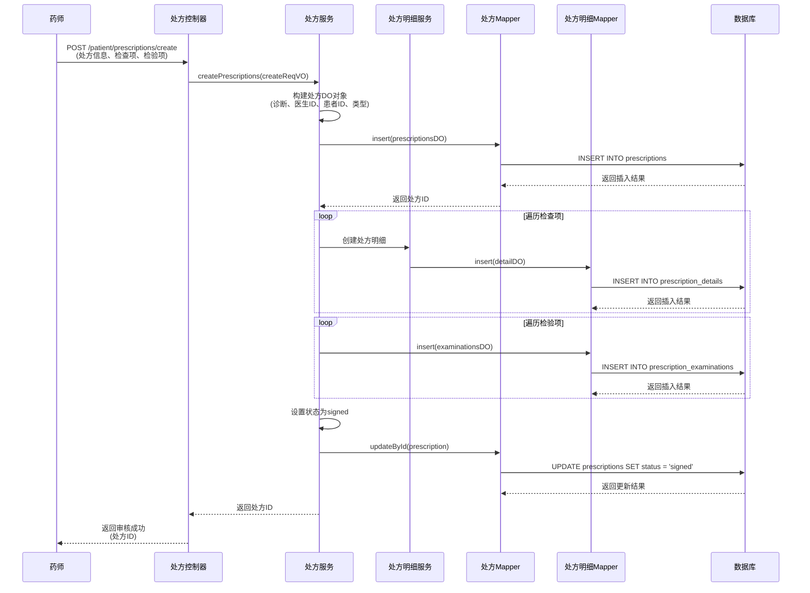
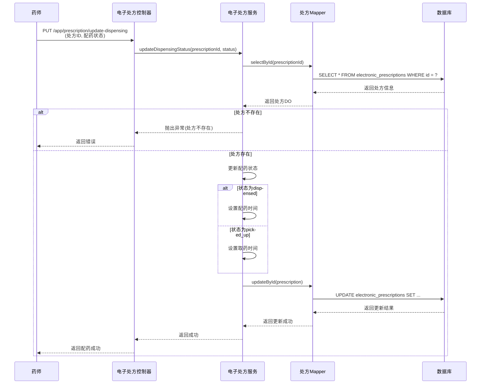
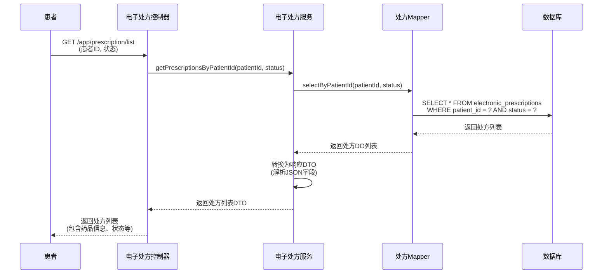
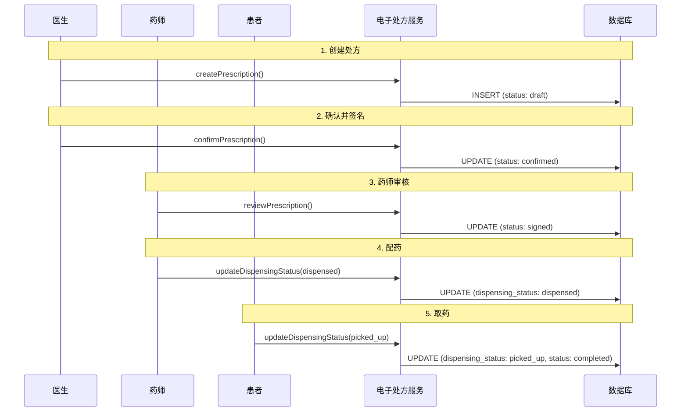

# 处方管理流程时序图

## 创建电子处方流程

```mermaid
sequenceDiagram
    participant 医生
    participant ElectronicPrescriptionController as 电子处方控制器
    participant ElectronicPrescriptionService as 电子处方服务
    participant ElectronicPrescriptionMapper as 处方Mapper
    participant 数据库

    医生->>ElectronicPrescriptionController: POST /app/prescription/create<br/>(处方信息)
    ElectronicPrescriptionController->>ElectronicPrescriptionService: createPrescription(reqDTO)
    
    ElectronicPrescriptionService->>ElectronicPrescriptionService: validatePrescriptionData(reqDTO)<br/>(验证工单ID、患者ID、医生ID、诊断、药品)
    
    alt 验证失败
        ElectronicPrescriptionService-->>ElectronicPrescriptionController: 抛出异常
        ElectronicPrescriptionController-->>医生: 返回错误信息
    else 验证成功
        ElectronicPrescriptionService->>ElectronicPrescriptionService: 转换为DO对象
        ElectronicPrescriptionService->>ElectronicPrescriptionService: 生成处方编号<br/>(如：RX-6F29-****)
        ElectronicPrescriptionService->>ElectronicPrescriptionService: 设置默认状态为draft
        ElectronicPrescriptionService->>ElectronicPrescriptionService: 设置有效期(默认7天)
        ElectronicPrescriptionService->>ElectronicPrescriptionService: 处理药品信息JSON
        
        ElectronicPrescriptionService->>ElectronicPrescriptionMapper: insert(prescriptionDO)
        ElectronicPrescriptionMapper->>数据库: INSERT INTO electronic_prescriptions
        数据库-->>ElectronicPrescriptionMapper: 返回插入结果
        ElectronicPrescriptionMapper-->>ElectronicPrescriptionService: 返回插入成功
        
        ElectronicPrescriptionService-->>ElectronicPrescriptionController: 返回处方ID
        ElectronicPrescriptionController-->>医生: 返回创建成功<br/>(处方ID)
    end
```

## 医生确认并签名处方流程

```mermaid
sequenceDiagram
    participant 医生
    participant ElectronicPrescriptionController as 电子处方控制器
    participant ElectronicPrescriptionService as 电子处方服务
    participant ElectronicPrescriptionMapper as 处方Mapper
    participant 数据库

    医生->>ElectronicPrescriptionController: PUT /app/prescription/confirm<br/>(处方ID, 电子签名)
    ElectronicPrescriptionController->>ElectronicPrescriptionService: confirmPrescription(id, signature)
    
    ElectronicPrescriptionService->>ElectronicPrescriptionMapper: selectById(id)
    ElectronicPrescriptionMapper->>数据库: SELECT * FROM electronic_prescriptions WHERE id = ?
    数据库-->>ElectronicPrescriptionMapper: 返回处方信息
    ElectronicPrescriptionMapper-->>ElectronicPrescriptionService: 返回处方DO
    
    alt 处方不存在
        ElectronicPrescriptionService-->>ElectronicPrescriptionController: 抛出异常(处方不存在)
        ElectronicPrescriptionController-->>医生: 返回错误
    else 处方存在
        ElectronicPrescriptionService->>ElectronicPrescriptionService: 设置电子签名
        ElectronicPrescriptionService->>ElectronicPrescriptionService: 设置签名时间
        ElectronicPrescriptionService->>ElectronicPrescriptionService: 设置签名证书
        ElectronicPrescriptionService->>ElectronicPrescriptionService: 状态转换为confirmed
        
        ElectronicPrescriptionService->>ElectronicPrescriptionMapper: updateById(prescription)
        ElectronicPrescriptionMapper->>数据库: UPDATE electronic_prescriptions SET ...
        数据库-->>ElectronicPrescriptionMapper: 返回更新结果
        ElectronicPrescriptionMapper-->>ElectronicPrescriptionService: 返回更新成功
        
        ElectronicPrescriptionService-->>ElectronicPrescriptionController: 返回成功
        ElectronicPrescriptionController-->>医生: 返回确认成功
    end
```

## 药师审核处方流程

```mermaid
sequenceDiagram
    participant 药师
    participant PrescriptionController as 处方控制器
    participant PrescriptionsService as 处方服务
    participant PrescriptionDetailService as 处方明细服务
    participant PrescriptionMapper as 处方Mapper
    participant PrescriptionDetailMapper as 处方明细Mapper
    participant 数据库

    药师->>PrescriptionController: POST /patient/prescriptions/create<br/>(处方信息、检查项、检验项)
    PrescriptionController->>PrescriptionsService: createPrescriptions(createReqVO)
    
    PrescriptionsService->>PrescriptionsService: 构建处方DO对象<br/>(诊断、医生ID、患者ID、类型)
    PrescriptionsService->>PrescriptionMapper: insert(prescriptionsDO)
    PrescriptionMapper->>数据库: INSERT INTO prescriptions
    数据库-->>PrescriptionMapper: 返回插入结果
    PrescriptionMapper-->>PrescriptionsService: 返回处方ID
    
    loop 遍历检查项
        PrescriptionsService->>PrescriptionDetailService: 创建处方明细
        PrescriptionDetailService->>PrescriptionDetailMapper: insert(detailDO)
        PrescriptionDetailMapper->>数据库: INSERT INTO prescription_details
        数据库-->>PrescriptionDetailMapper: 返回插入结果
    end
    
    loop 遍历检验项
        PrescriptionsService->>PrescriptionDetailMapper: insert(examinationsDO)
        PrescriptionDetailMapper->>数据库: INSERT INTO prescription_examinations
        数据库-->>PrescriptionDetailMapper: 返回插入结果
    end
    
    PrescriptionsService->>PrescriptionsService: 设置状态为signed
    PrescriptionsService->>PrescriptionMapper: updateById(prescription)
    PrescriptionMapper->>数据库: UPDATE prescriptions SET status = 'signed'
    数据库-->>PrescriptionMapper: 返回更新结果
    
    PrescriptionsService-->>PrescriptionController: 返回处方ID
    PrescriptionController-->>药师: 返回审核成功<br/>(处方ID)
```

## 药师配药流程

```mermaid
sequenceDiagram
    participant 药师
    participant ElectronicPrescriptionController as 电子处方控制器
    participant ElectronicPrescriptionService as 电子处方服务
    participant ElectronicPrescriptionMapper as 处方Mapper
    participant 数据库

    药师->>ElectronicPrescriptionController: PUT /app/prescription/update-dispensing<br/>(处方ID, 配药状态)
    ElectronicPrescriptionController->>ElectronicPrescriptionService: updateDispensingStatus(prescriptionId, status)
    
    ElectronicPrescriptionService->>ElectronicPrescriptionMapper: selectById(prescriptionId)
    ElectronicPrescriptionMapper->>数据库: SELECT * FROM electronic_prescriptions WHERE id = ?
    数据库-->>ElectronicPrescriptionMapper: 返回处方信息
    ElectronicPrescriptionMapper-->>ElectronicPrescriptionService: 返回处方DO
    
    alt 处方不存在
        ElectronicPrescriptionService-->>ElectronicPrescriptionController: 抛出异常(处方不存在)
        ElectronicPrescriptionController-->>药师: 返回错误
    else 处方存在
        ElectronicPrescriptionService->>ElectronicPrescriptionService: 更新配药状态
        
        alt 状态为dispensed
            ElectronicPrescriptionService->>ElectronicPrescriptionService: 设置配药时间
        else 状态为picked_up
            ElectronicPrescriptionService->>ElectronicPrescriptionService: 设置取药时间
        end
        
        ElectronicPrescriptionService->>ElectronicPrescriptionMapper: updateById(prescription)
        ElectronicPrescriptionMapper->>数据库: UPDATE electronic_prescriptions SET ...
        数据库-->>ElectronicPrescriptionMapper: 返回更新结果
        ElectronicPrescriptionMapper-->>ElectronicPrescriptionService: 返回更新成功
        
        ElectronicPrescriptionService-->>ElectronicPrescriptionController: 返回成功
        ElectronicPrescriptionController-->>药师: 返回配药成功
    end
```

## 患者查询处方流程

```mermaid
sequenceDiagram
    participant 患者
    participant ElectronicPrescriptionController as 电子处方控制器
    participant ElectronicPrescriptionService as 电子处方服务
    participant ElectronicPrescriptionMapper as 处方Mapper
    participant 数据库

    患者->>ElectronicPrescriptionController: GET /app/prescription/list<br/>(患者ID, 状态)
    ElectronicPrescriptionController->>ElectronicPrescriptionService: getPrescriptionsByPatientId(patientId, status)
    
    ElectronicPrescriptionService->>ElectronicPrescriptionMapper: selectByPatientId(patientId, status)
    ElectronicPrescriptionMapper->>数据库: SELECT * FROM electronic_prescriptions<br/>WHERE patient_id = ? AND status = ?
    数据库-->>ElectronicPrescriptionMapper: 返回处方列表
    ElectronicPrescriptionMapper-->>ElectronicPrescriptionService: 返回处方DO列表
    
    ElectronicPrescriptionService->>ElectronicPrescriptionService: 转换为响应DTO<br/>(解析JSON字段)
    ElectronicPrescriptionService-->>ElectronicPrescriptionController: 返回处方列表DTO
    ElectronicPrescriptionController-->>患者: 返回处方列表<br/>(包含药品信息、状态等)
```

## 处方状态流转

```mermaid
sequenceDiagram
    participant 医生
    participant 药师
    participant 患者
    participant ElectronicPrescriptionService as 电子处方服务
    participant 数据库

    Note over 医生,数据库: 1. 创建处方
    医生->>ElectronicPrescriptionService: createPrescription()
    ElectronicPrescriptionService->>数据库: INSERT (status: draft)
    
    Note over 医生,数据库: 2. 确认并签名
    医生->>ElectronicPrescriptionService: confirmPrescription()
    ElectronicPrescriptionService->>数据库: UPDATE (status: confirmed)
    
    Note over 药师,数据库: 3. 药师审核
    药师->>ElectronicPrescriptionService: reviewPrescription()
    ElectronicPrescriptionService->>数据库: UPDATE (status: signed)
    
    Note over 药师,数据库: 4. 配药
    药师->>ElectronicPrescriptionService: updateDispensingStatus(dispensed)
    ElectronicPrescriptionService->>数据库: UPDATE (dispensing_status: dispensed)
    
    Note over 患者,数据库: 5. 取药
    患者->>ElectronicPrescriptionService: updateDispensingStatus(picked_up)
    ElectronicPrescriptionService->>数据库: UPDATE (dispensing_status: picked_up, status: completed)
```

