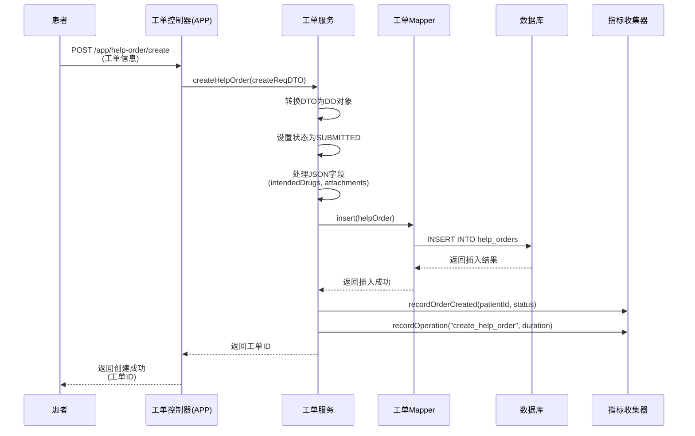
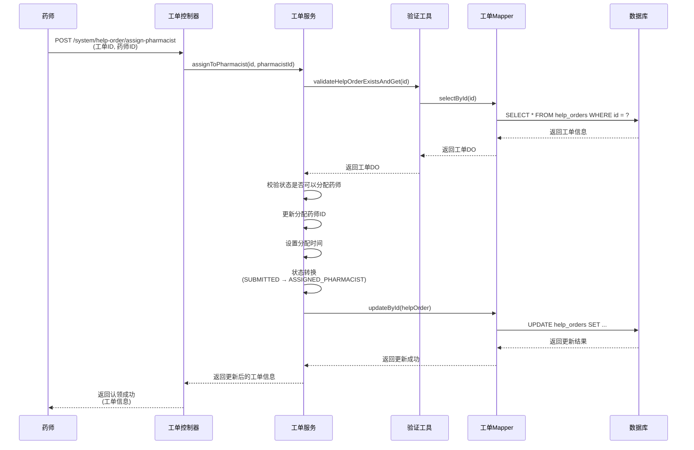
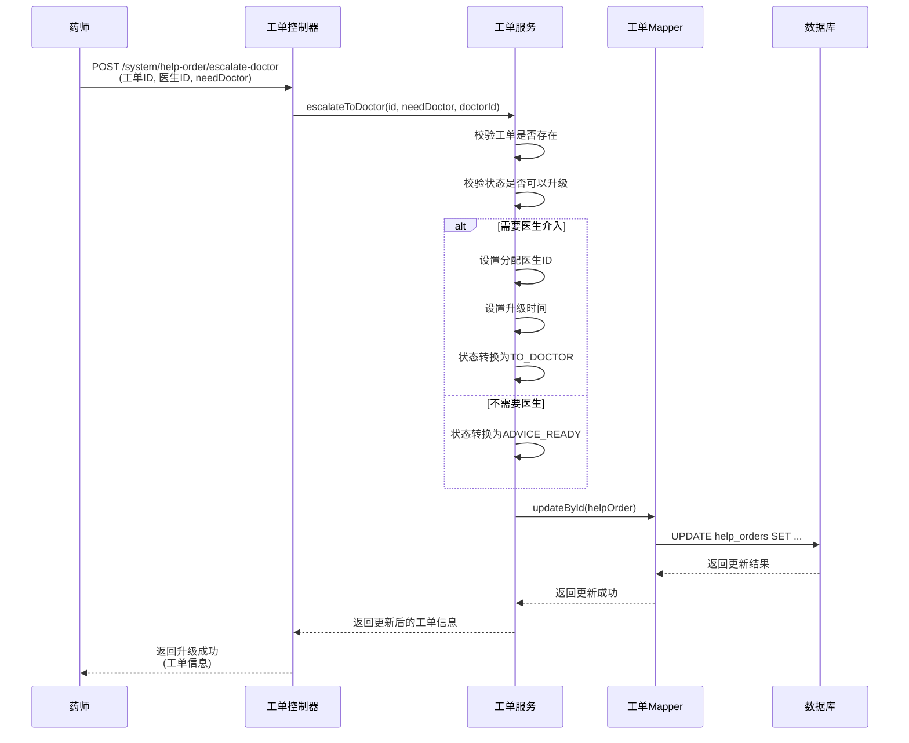
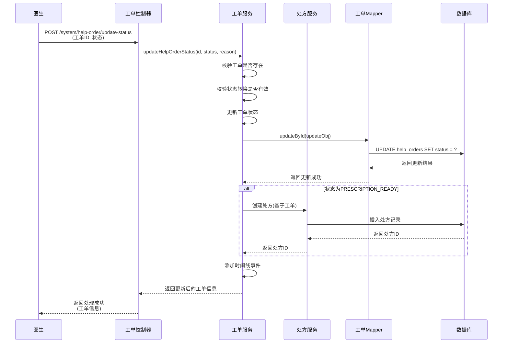
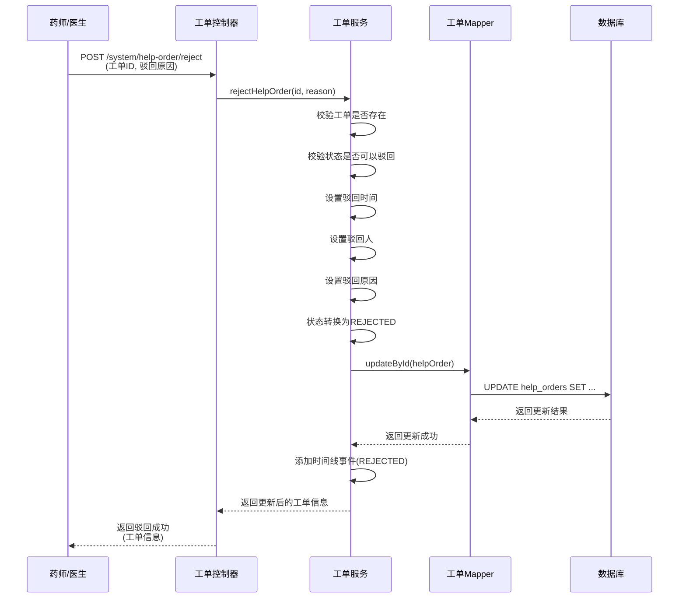
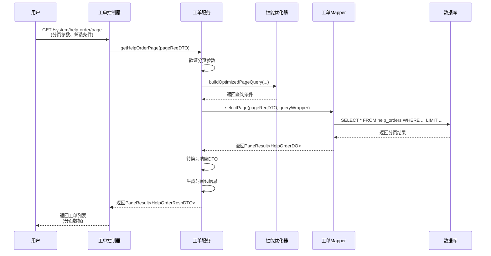

# 工单处理流程时序图

## 患者提交工单流程

```mermaid
sequenceDiagram
    participant 患者
    participant AppHelpOrderController as 工单控制器(APP)
    participant HelpOrderService as 工单服务
    participant HelpOrderMapper as 工单Mapper
    participant 数据库
    participant HelpOrderMetricsCollector as 指标收集器

    患者->>AppHelpOrderController: POST /app/help-order/create<br/>(工单信息)
    AppHelpOrderController->>HelpOrderService: createHelpOrder(createReqDTO)
    
    HelpOrderService->>HelpOrderService: 转换DTO为DO对象
    HelpOrderService->>HelpOrderService: 设置状态为SUBMITTED
    HelpOrderService->>HelpOrderService: 处理JSON字段<br/>(intendedDrugs, attachments)
    
    HelpOrderService->>HelpOrderMapper: insert(helpOrder)
    HelpOrderMapper->>数据库: INSERT INTO help_orders
    数据库-->>HelpOrderMapper: 返回插入结果
    HelpOrderMapper-->>HelpOrderService: 返回插入成功
    
    HelpOrderService->>HelpOrderMetricsCollector: recordOrderCreated(patientId, status)
    HelpOrderService->>HelpOrderMetricsCollector: recordOperation("create_help_order", duration)
    
    HelpOrderService-->>AppHelpOrderController: 返回工单ID
    AppHelpOrderController-->>患者: 返回创建成功<br/>(工单ID)
```

## 药师认领工单流程

```mermaid
sequenceDiagram
    participant 药师
    participant HelpOrderController as 工单控制器
    participant HelpOrderService as 工单服务
    participant HelpOrderValidationUtils as 验证工具
    participant HelpOrderMapper as 工单Mapper
    participant 数据库

    药师->>HelpOrderController: POST /system/help-order/assign-pharmacist<br/>(工单ID, 药师ID)
    HelpOrderController->>HelpOrderService: assignToPharmacist(id, pharmacistId)
    
    HelpOrderService->>HelpOrderValidationUtils: validateHelpOrderExistsAndGet(id)
    HelpOrderValidationUtils->>HelpOrderMapper: selectById(id)
    HelpOrderMapper->>数据库: SELECT * FROM help_orders WHERE id = ?
    数据库-->>HelpOrderMapper: 返回工单信息
    HelpOrderMapper-->>HelpOrderValidationUtils: 返回工单DO
    HelpOrderValidationUtils-->>HelpOrderService: 返回工单DO
    
    HelpOrderService->>HelpOrderService: 校验状态是否可以分配药师
    HelpOrderService->>HelpOrderService: 更新分配药师ID
    HelpOrderService->>HelpOrderService: 设置分配时间
    HelpOrderService->>HelpOrderService: 状态转换<br/>(SUBMITTED → ASSIGNED_PHARMACIST)
    
    HelpOrderService->>HelpOrderMapper: updateById(helpOrder)
    HelpOrderMapper->>数据库: UPDATE help_orders SET ...
    数据库-->>HelpOrderMapper: 返回更新结果
    HelpOrderMapper-->>HelpOrderService: 返回更新成功
    
    HelpOrderService-->>HelpOrderController: 返回更新后的工单信息
    HelpOrderController-->>药师: 返回认领成功<br/>(工单信息)
```

## 升级到医生流程

```mermaid
sequenceDiagram
    participant 药师
    participant HelpOrderController as 工单控制器
    participant HelpOrderService as 工单服务
    participant HelpOrderMapper as 工单Mapper
    participant 数据库

    药师->>HelpOrderController: POST /system/help-order/escalate-doctor<br/>(工单ID, 医生ID, needDoctor)
    HelpOrderController->>HelpOrderService: escalateToDoctor(id, needDoctor, doctorId)
    
    HelpOrderService->>HelpOrderService: 校验工单是否存在
    HelpOrderService->>HelpOrderService: 校验状态是否可以升级
    
    alt 需要医生介入
        HelpOrderService->>HelpOrderService: 设置分配医生ID
        HelpOrderService->>HelpOrderService: 设置升级时间
        HelpOrderService->>HelpOrderService: 状态转换为TO_DOCTOR
    else 不需要医生
        HelpOrderService->>HelpOrderService: 状态转换为ADVICE_READY
    end
    
    HelpOrderService->>HelpOrderMapper: updateById(helpOrder)
    HelpOrderMapper->>数据库: UPDATE help_orders SET ...
    数据库-->>HelpOrderMapper: 返回更新结果
    HelpOrderMapper-->>HelpOrderService: 返回更新成功
    
    HelpOrderService-->>HelpOrderController: 返回更新后的工单信息
    HelpOrderController-->>药师: 返回升级成功<br/>(工单信息)
```

## 医生处理工单流程

```mermaid
sequenceDiagram
    participant 医生
    participant HelpOrderController as 工单控制器
    participant HelpOrderService as 工单服务
    participant ElectronicPrescriptionService as 处方服务
    participant HelpOrderMapper as 工单Mapper
    participant 数据库

    医生->>HelpOrderController: POST /system/help-order/update-status<br/>(工单ID, 状态)
    HelpOrderController->>HelpOrderService: updateHelpOrderStatus(id, status, reason)
    
    HelpOrderService->>HelpOrderService: 校验工单是否存在
    HelpOrderService->>HelpOrderService: 校验状态转换是否有效
    
    HelpOrderService->>HelpOrderService: 更新工单状态
    HelpOrderService->>HelpOrderMapper: updateById(updateObj)
    HelpOrderMapper->>数据库: UPDATE help_orders SET status = ?
    数据库-->>HelpOrderMapper: 返回更新结果
    HelpOrderMapper-->>HelpOrderService: 返回更新成功
    
    alt 状态为PRESCRIPTION_READY
        HelpOrderService->>ElectronicPrescriptionService: 创建处方(基于工单)
        ElectronicPrescriptionService->>数据库: 插入处方记录
        数据库-->>ElectronicPrescriptionService: 返回处方ID
        ElectronicPrescriptionService-->>HelpOrderService: 返回处方ID
    end
    
    HelpOrderService->>HelpOrderService: 添加时间线事件
    HelpOrderService-->>HelpOrderController: 返回更新后的工单信息
    HelpOrderController-->>医生: 返回处理成功<br/>(工单信息)
```

## 工单驳回流程

```mermaid
sequenceDiagram
    participant 药师/医生
    participant HelpOrderController as 工单控制器
    participant HelpOrderService as 工单服务
    participant HelpOrderMapper as 工单Mapper
    participant 数据库

    药师/医生->>HelpOrderController: POST /system/help-order/reject<br/>(工单ID, 驳回原因)
    HelpOrderController->>HelpOrderService: rejectHelpOrder(id, reason)
    
    HelpOrderService->>HelpOrderService: 校验工单是否存在
    HelpOrderService->>HelpOrderService: 校验状态是否可以驳回
    
    HelpOrderService->>HelpOrderService: 设置驳回时间
    HelpOrderService->>HelpOrderService: 设置驳回人
    HelpOrderService->>HelpOrderService: 设置驳回原因
    HelpOrderService->>HelpOrderService: 状态转换为REJECTED
    
    HelpOrderService->>HelpOrderMapper: updateById(helpOrder)
    HelpOrderMapper->>数据库: UPDATE help_orders SET ...
    数据库-->>HelpOrderMapper: 返回更新结果
    HelpOrderMapper-->>HelpOrderService: 返回更新成功
    
    HelpOrderService->>HelpOrderService: 添加时间线事件(REJECTED)
    HelpOrderService-->>HelpOrderController: 返回更新后的工单信息
    HelpOrderController-->>药师/医生: 返回驳回成功<br/>(工单信息)
```

## 工单查询流程

```mermaid
sequenceDiagram
    participant 用户
    participant HelpOrderController as 工单控制器
    participant HelpOrderService as 工单服务
    participant HelpOrderPerformanceOptimizer as 性能优化器
    participant HelpOrderMapper as 工单Mapper
    participant 数据库

    用户->>HelpOrderController: GET /system/help-order/page<br/>(分页参数、筛选条件)
    HelpOrderController->>HelpOrderService: getHelpOrderPage(pageReqDTO)
    
    HelpOrderService->>HelpOrderService: 验证分页参数
    HelpOrderService->>HelpOrderPerformanceOptimizer: buildOptimizedPageQuery(...)
    HelpOrderPerformanceOptimizer-->>HelpOrderService: 返回查询条件
    
    HelpOrderService->>HelpOrderMapper: selectPage(pageReqDTO, queryWrapper)
    HelpOrderMapper->>数据库: SELECT * FROM help_orders WHERE ... LIMIT ...
    数据库-->>HelpOrderMapper: 返回分页结果
    HelpOrderMapper-->>HelpOrderService: 返回PageResult<HelpOrderDO>
    
    HelpOrderService->>HelpOrderService: 转换为响应DTO
    HelpOrderService->>HelpOrderService: 生成时间线信息
    HelpOrderService-->>HelpOrderController: 返回PageResult<HelpOrderRespDTO>
    HelpOrderController-->>用户: 返回工单列表<br/>(分页数据)
```

