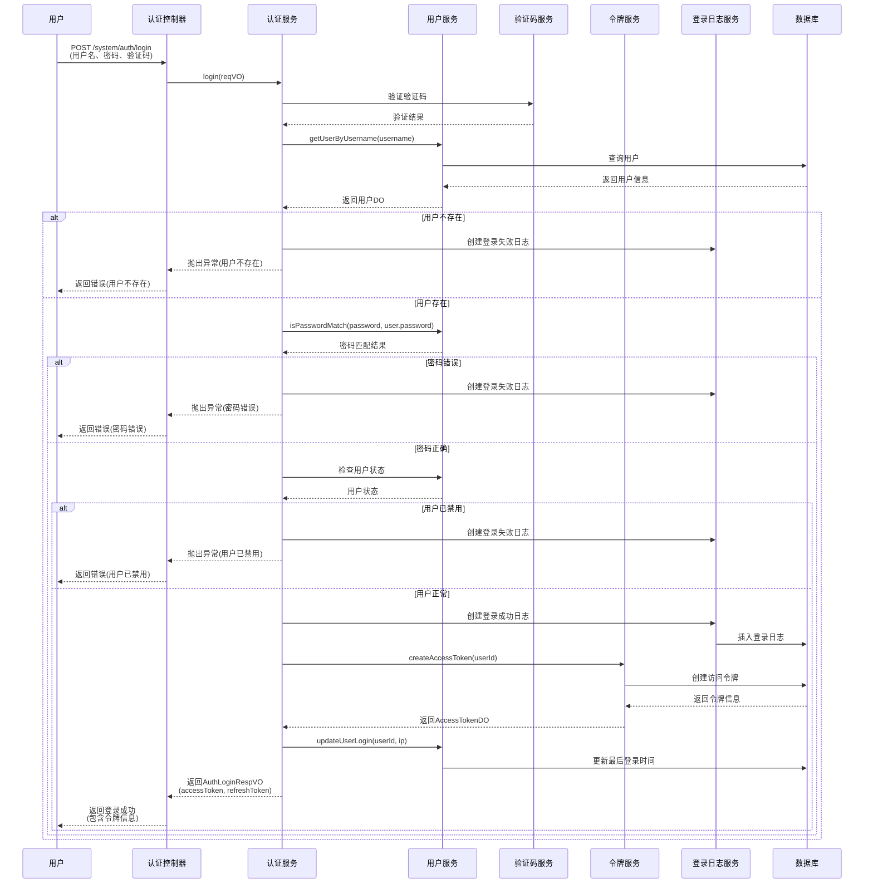
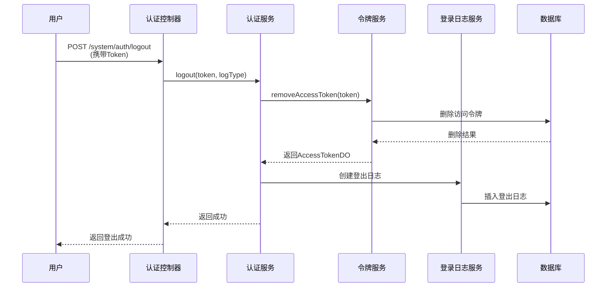
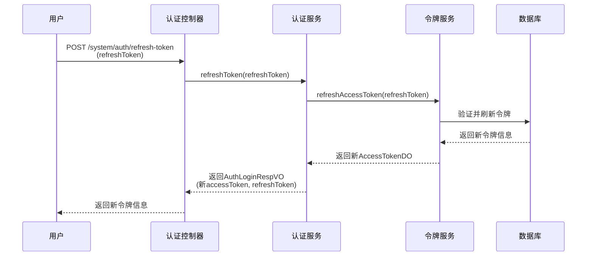
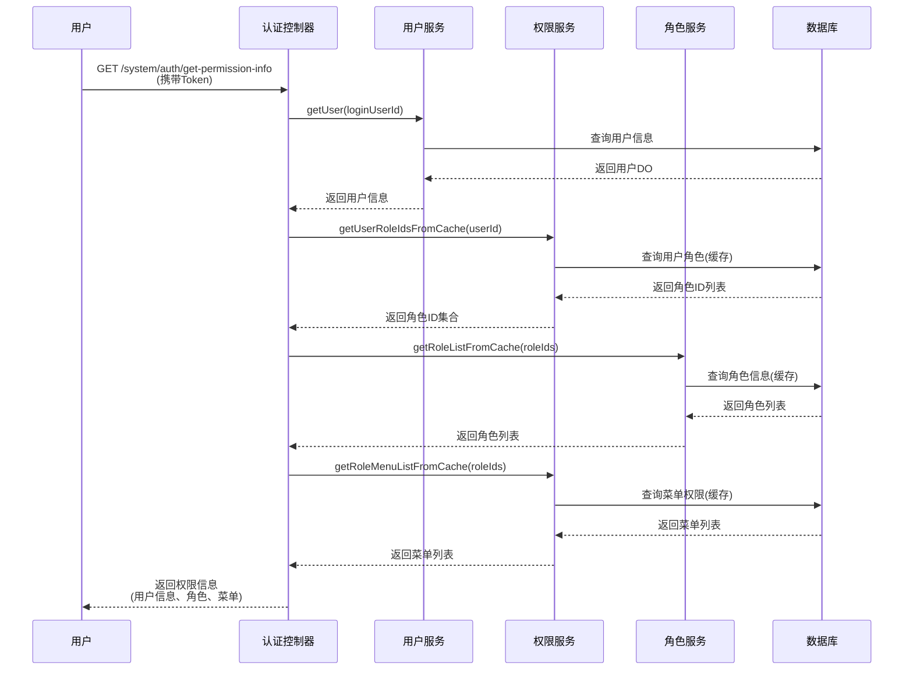

# 用户登录认证时序图

## 用户登录流程

```mermaid
sequenceDiagram
    participant 用户
    participant AuthController as 认证控制器
    participant AdminAuthService as 认证服务
    participant AdminUserService as 用户服务
    participant CaptchaService as 验证码服务
    participant OAuth2TokenService as 令牌服务
    participant LoginLogService as 登录日志服务
    participant 数据库

    用户->>AuthController: POST /system/auth/login<br/>(用户名、密码、验证码)
    AuthController->>AdminAuthService: login(reqVO)
    
    AdminAuthService->>CaptchaService: 验证验证码
    CaptchaService-->>AdminAuthService: 验证结果
    
    AdminAuthService->>AdminUserService: getUserByUsername(username)
    AdminUserService->>数据库: 查询用户
    数据库-->>AdminUserService: 返回用户信息
    AdminUserService-->>AdminAuthService: 返回用户DO
    
    alt 用户不存在
        AdminAuthService->>LoginLogService: 创建登录失败日志
        AdminAuthService-->>AuthController: 抛出异常(用户不存在)
        AuthController-->>用户: 返回错误(用户不存在)
    else 用户存在
        AdminAuthService->>AdminUserService: isPasswordMatch(password, user.password)
        AdminUserService-->>AdminAuthService: 密码匹配结果
        
        alt 密码错误
            AdminAuthService->>LoginLogService: 创建登录失败日志
            AdminAuthService-->>AuthController: 抛出异常(密码错误)
            AuthController-->>用户: 返回错误(密码错误)
        else 密码正确
            AdminAuthService->>AdminUserService: 检查用户状态
            AdminUserService-->>AdminAuthService: 用户状态
            
            alt 用户已禁用
                AdminAuthService->>LoginLogService: 创建登录失败日志
                AdminAuthService-->>AuthController: 抛出异常(用户已禁用)
                AuthController-->>用户: 返回错误(用户已禁用)
            else 用户正常
                AdminAuthService->>LoginLogService: 创建登录成功日志
                LoginLogService->>数据库: 插入登录日志
                
                AdminAuthService->>OAuth2TokenService: createAccessToken(userId)
                OAuth2TokenService->>数据库: 创建访问令牌
                数据库-->>OAuth2TokenService: 返回令牌信息
                OAuth2TokenService-->>AdminAuthService: 返回AccessTokenDO
                
                AdminAuthService->>AdminUserService: updateUserLogin(userId, ip)
                AdminUserService->>数据库: 更新最后登录时间
                
                AdminAuthService-->>AuthController: 返回AuthLoginRespVO<br/>(accessToken, refreshToken)
                AuthController-->>用户: 返回登录成功<br/>(包含令牌信息)
            end
        end
    end
```

## 用户登出流程

```mermaid
sequenceDiagram
    participant 用户
    participant AuthController as 认证控制器
    participant AdminAuthService as 认证服务
    participant OAuth2TokenService as 令牌服务
    participant LoginLogService as 登录日志服务
    participant 数据库

    用户->>AuthController: POST /system/auth/logout<br/>(携带Token)
    AuthController->>AdminAuthService: logout(token, logType)
    
    AdminAuthService->>OAuth2TokenService: removeAccessToken(token)
    OAuth2TokenService->>数据库: 删除访问令牌
    数据库-->>OAuth2TokenService: 删除结果
    OAuth2TokenService-->>AdminAuthService: 返回AccessTokenDO
    
    AdminAuthService->>LoginLogService: 创建登出日志
    LoginLogService->>数据库: 插入登出日志
    
    AdminAuthService-->>AuthController: 返回成功
    AuthController-->>用户: 返回登出成功
```

## 刷新令牌流程

```mermaid
sequenceDiagram
    participant 用户
    participant AuthController as 认证控制器
    participant AdminAuthService as 认证服务
    participant OAuth2TokenService as 令牌服务
    participant 数据库

    用户->>AuthController: POST /system/auth/refresh-token<br/>(refreshToken)
    AuthController->>AdminAuthService: refreshToken(refreshToken)
    
    AdminAuthService->>OAuth2TokenService: refreshAccessToken(refreshToken)
    OAuth2TokenService->>数据库: 验证并刷新令牌
    数据库-->>OAuth2TokenService: 返回新令牌信息
    OAuth2TokenService-->>AdminAuthService: 返回新AccessTokenDO
    
    AdminAuthService-->>AuthController: 返回AuthLoginRespVO<br/>(新accessToken, refreshToken)
    AuthController-->>用户: 返回新令牌信息
```

## 获取权限信息流程

```mermaid
sequenceDiagram
    participant 用户
    participant AuthController as 认证控制器
    participant AdminUserService as 用户服务
    participant PermissionService as 权限服务
    participant RoleService as 角色服务
    participant 数据库

    用户->>AuthController: GET /system/auth/get-permission-info<br/>(携带Token)
    
    AuthController->>AdminUserService: getUser(loginUserId)
    AdminUserService->>数据库: 查询用户信息
    数据库-->>AdminUserService: 返回用户DO
    AdminUserService-->>AuthController: 返回用户信息
    
    AuthController->>PermissionService: getUserRoleIdsFromCache(userId)
    PermissionService->>数据库: 查询用户角色(缓存)
    数据库-->>PermissionService: 返回角色ID列表
    PermissionService-->>AuthController: 返回角色ID集合
    
    AuthController->>RoleService: getRoleListFromCache(roleIds)
    RoleService->>数据库: 查询角色信息(缓存)
    数据库-->>RoleService: 返回角色列表
    RoleService-->>AuthController: 返回角色列表
    
    AuthController->>PermissionService: getRoleMenuListFromCache(roleIds)
    PermissionService->>数据库: 查询菜单权限(缓存)
    数据库-->>PermissionService: 返回菜单列表
    PermissionService-->>AuthController: 返回菜单列表
    
    AuthController-->>用户: 返回权限信息<br/>(用户信息、角色、菜单)
```

