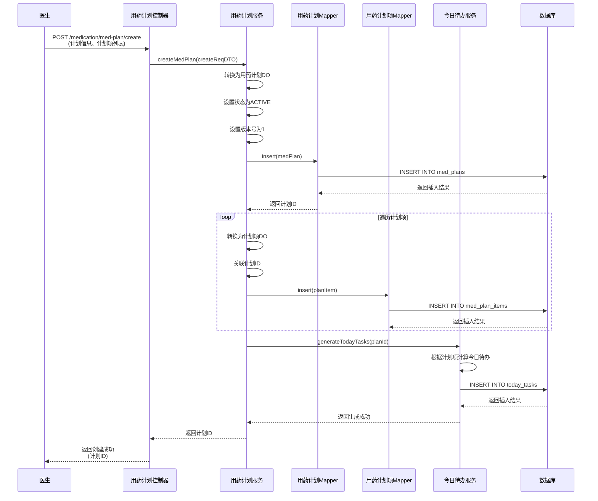
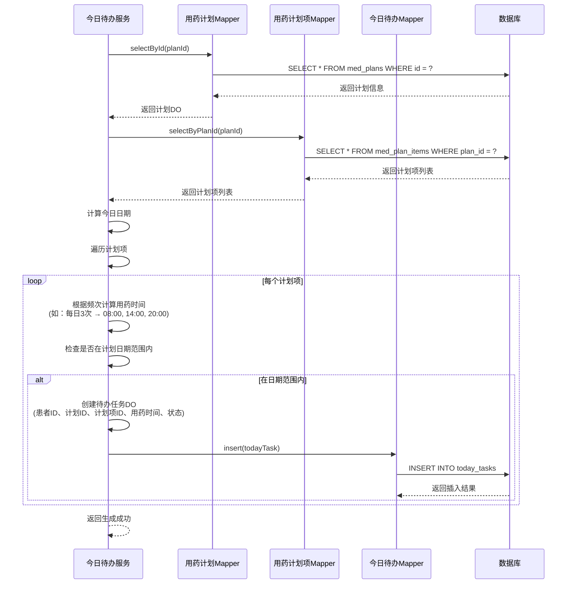
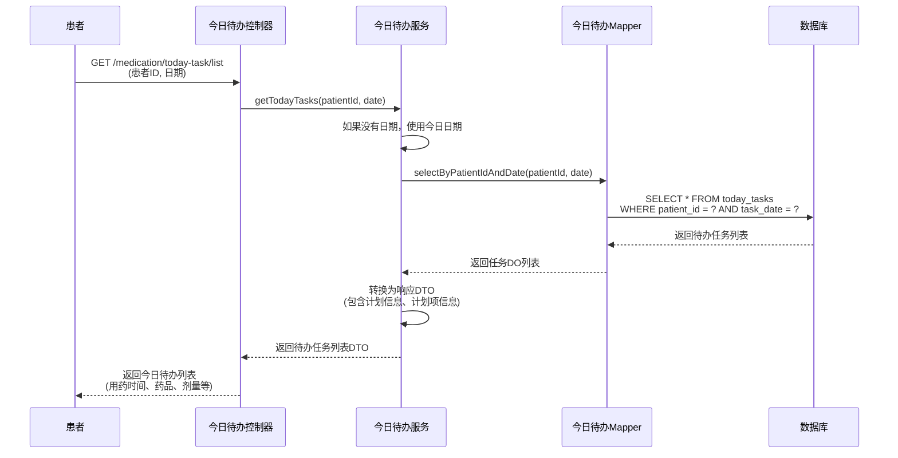
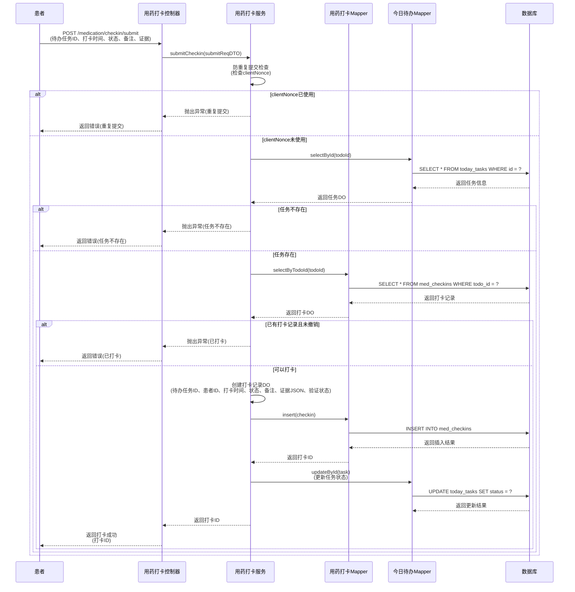
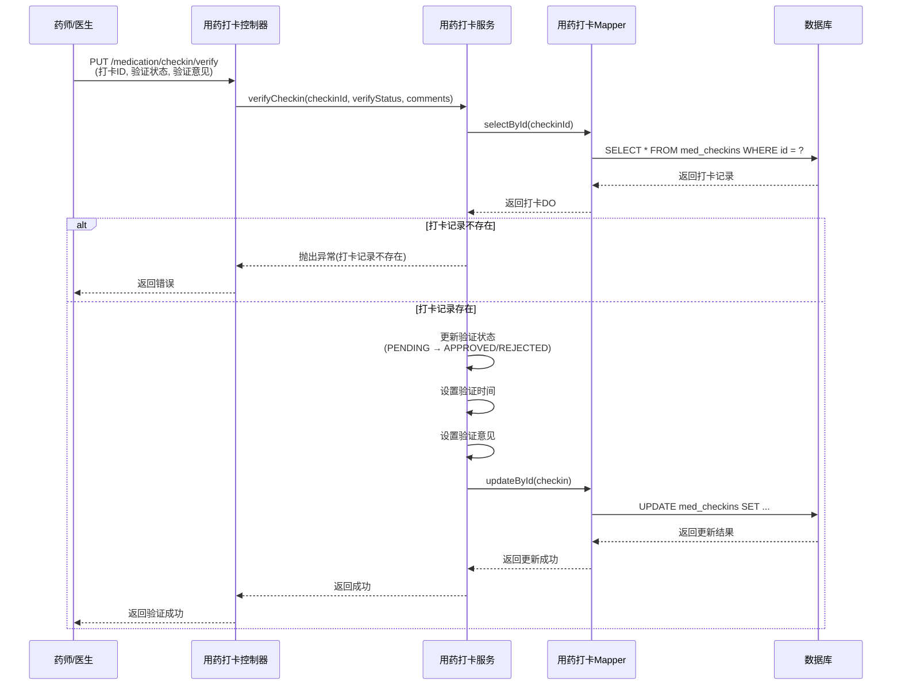
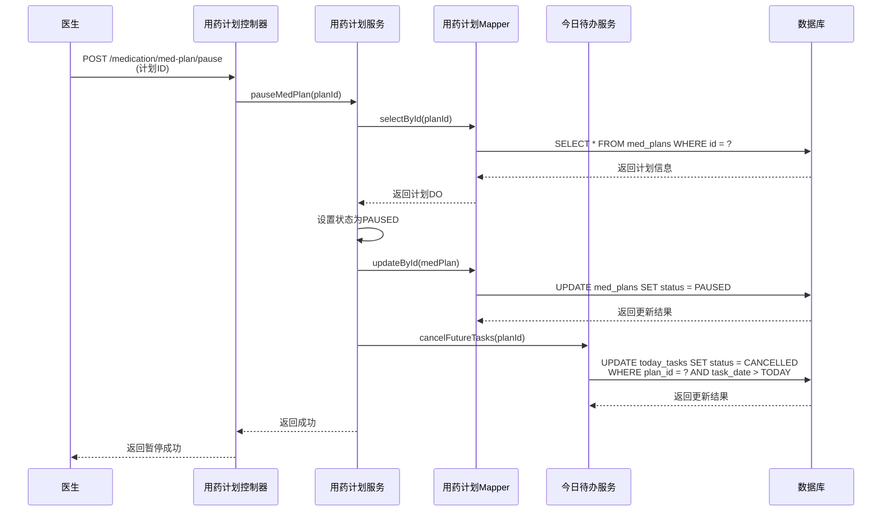
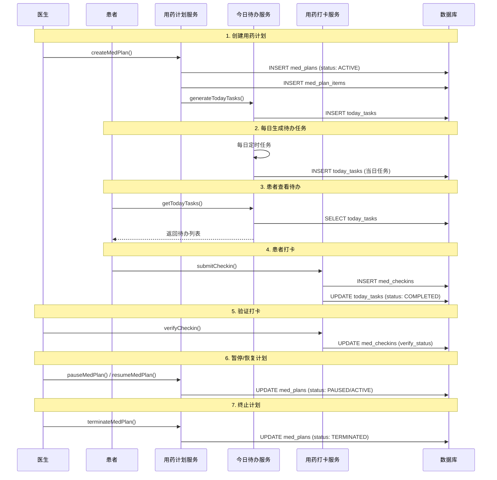

# 用药计划管理时序图

## 创建用药计划流程

```mermaid
sequenceDiagram
    participant 医生
    participant MedPlanController as 用药计划控制器
    participant MedPlanService as 用药计划服务
    participant MedPlanMapper as 用药计划Mapper
    participant MedPlanItemMapper as 用药计划项Mapper
    participant TodayTaskService as 今日待办服务
    participant 数据库

    医生->>MedPlanController: POST /medication/med-plan/create<br/>(计划信息、计划项列表)
    MedPlanController->>MedPlanService: createMedPlan(createReqDTO)
    
    MedPlanService->>MedPlanService: 转换为用药计划DO
    MedPlanService->>MedPlanService: 设置状态为ACTIVE
    MedPlanService->>MedPlanService: 设置版本号为1
    
    MedPlanService->>MedPlanMapper: insert(medPlan)
    MedPlanMapper->>数据库: INSERT INTO med_plans
    数据库-->>MedPlanMapper: 返回插入结果
    MedPlanMapper-->>MedPlanService: 返回计划ID
    
    loop 遍历计划项
        MedPlanService->>MedPlanService: 转换为计划项DO
        MedPlanService->>MedPlanService: 关联计划ID
        MedPlanService->>MedPlanItemMapper: insert(planItem)
        MedPlanItemMapper->>数据库: INSERT INTO med_plan_items
        数据库-->>MedPlanItemMapper: 返回插入结果
    end
    
    MedPlanService->>TodayTaskService: generateTodayTasks(planId)
    TodayTaskService->>TodayTaskService: 根据计划项计算今日待办
    TodayTaskService->>数据库: INSERT INTO today_tasks
    数据库-->>TodayTaskService: 返回插入结果
    TodayTaskService-->>MedPlanService: 返回生成成功
    
    MedPlanService-->>MedPlanController: 返回计划ID
    MedPlanController-->>医生: 返回创建成功<br/>(计划ID)
```

## 生成今日待办任务流程

```mermaid
sequenceDiagram
    participant TodayTaskService as 今日待办服务
    participant MedPlanMapper as 用药计划Mapper
    participant MedPlanItemMapper as 用药计划项Mapper
    participant TodayTaskMapper as 今日待办Mapper
    participant 数据库

    TodayTaskService->>MedPlanMapper: selectById(planId)
    MedPlanMapper->>数据库: SELECT * FROM med_plans WHERE id = ?
    数据库-->>MedPlanMapper: 返回计划信息
    MedPlanMapper-->>TodayTaskService: 返回计划DO
    
    TodayTaskService->>MedPlanItemMapper: selectByPlanId(planId)
    MedPlanItemMapper->>数据库: SELECT * FROM med_plan_items WHERE plan_id = ?
    数据库-->>MedPlanItemMapper: 返回计划项列表
    MedPlanItemMapper-->>TodayTaskService: 返回计划项列表
    
    TodayTaskService->>TodayTaskService: 计算今日日期
    TodayTaskService->>TodayTaskService: 遍历计划项
    
    loop 每个计划项
        TodayTaskService->>TodayTaskService: 根据频次计算用药时间<br/>(如：每日3次 → 08:00, 14:00, 20:00)
        TodayTaskService->>TodayTaskService: 检查是否在计划日期范围内
        
        alt 在日期范围内
            TodayTaskService->>TodayTaskService: 创建待办任务DO<br/>(患者ID、计划ID、计划项ID、用药时间、状态)
            TodayTaskService->>TodayTaskMapper: insert(todayTask)
            TodayTaskMapper->>数据库: INSERT INTO today_tasks
            数据库-->>TodayTaskMapper: 返回插入结果
        end
    end
    
    TodayTaskService-->>TodayTaskService: 返回生成成功
```

## 患者查看今日待办流程

```mermaid
sequenceDiagram
    participant 患者
    participant TodayTaskController as 今日待办控制器
    participant TodayTaskService as 今日待办服务
    participant TodayTaskMapper as 今日待办Mapper
    participant 数据库

    患者->>TodayTaskController: GET /medication/today-task/list<br/>(患者ID, 日期)
    TodayTaskController->>TodayTaskService: getTodayTasks(patientId, date)
    
    TodayTaskService->>TodayTaskService: 如果没有日期，使用今日日期
    TodayTaskService->>TodayTaskMapper: selectByPatientIdAndDate(patientId, date)
    TodayTaskMapper->>数据库: SELECT * FROM today_tasks<br/>WHERE patient_id = ? AND task_date = ?
    数据库-->>TodayTaskMapper: 返回待办任务列表
    TodayTaskMapper-->>TodayTaskService: 返回任务DO列表
    
    TodayTaskService->>TodayTaskService: 转换为响应DTO<br/>(包含计划信息、计划项信息)
    TodayTaskService-->>TodayTaskController: 返回待办任务列表DTO
    TodayTaskController-->>患者: 返回今日待办列表<br/>(用药时间、药品、剂量等)
```

## 患者提交用药打卡流程

```mermaid
sequenceDiagram
    participant 患者
    participant MedCheckinController as 用药打卡控制器
    participant MedCheckinService as 用药打卡服务
    participant MedCheckinMapper as 用药打卡Mapper
    participant TodayTaskMapper as 今日待办Mapper
    participant 数据库

    患者->>MedCheckinController: POST /medication/checkin/submit<br/>(待办任务ID、打卡时间、状态、备注、证据)
    MedCheckinController->>MedCheckinService: submitCheckin(submitReqDTO)
    
    MedCheckinService->>MedCheckinService: 防重复提交检查<br/>(检查clientNonce)
    
    alt clientNonce已使用
        MedCheckinService-->>MedCheckinController: 抛出异常(重复提交)
        MedCheckinController-->>患者: 返回错误(重复提交)
    else clientNonce未使用
        MedCheckinService->>TodayTaskMapper: selectById(todoId)
        TodayTaskMapper->>数据库: SELECT * FROM today_tasks WHERE id = ?
        数据库-->>TodayTaskMapper: 返回任务信息
        TodayTaskMapper-->>MedCheckinService: 返回任务DO
        
        alt 任务不存在
            MedCheckinService-->>MedCheckinController: 抛出异常(任务不存在)
            MedCheckinController-->>患者: 返回错误(任务不存在)
        else 任务存在
            MedCheckinService->>MedCheckinMapper: selectByTodoId(todoId)
            MedCheckinMapper->>数据库: SELECT * FROM med_checkins WHERE todo_id = ?
            数据库-->>MedCheckinMapper: 返回打卡记录
            MedCheckinMapper-->>MedCheckinService: 返回打卡DO
            
            alt 已有打卡记录且未撤销
                MedCheckinService-->>MedCheckinController: 抛出异常(已打卡)
                MedCheckinController-->>患者: 返回错误(已打卡)
            else 可以打卡
                MedCheckinService->>MedCheckinService: 创建打卡记录DO<br/>(待办任务ID、患者ID、打卡时间、状态、备注、证据JSON、验证状态)
                MedCheckinService->>MedCheckinMapper: insert(checkin)
                MedCheckinMapper->>数据库: INSERT INTO med_checkins
                数据库-->>MedCheckinMapper: 返回插入结果
                MedCheckinMapper-->>MedCheckinService: 返回打卡ID
                
                MedCheckinService->>TodayTaskMapper: updateById(task)<br/>(更新任务状态)
                TodayTaskMapper->>数据库: UPDATE today_tasks SET status = ?
                数据库-->>TodayTaskMapper: 返回更新结果
                
                MedCheckinService-->>MedCheckinController: 返回打卡ID
                MedCheckinController-->>患者: 返回打卡成功<br/>(打卡ID)
            end
        end
    end
```

## 验证用药打卡流程

```mermaid
sequenceDiagram
    participant 药师/医生
    participant MedCheckinController as 用药打卡控制器
    participant MedCheckinService as 用药打卡服务
    participant MedCheckinMapper as 用药打卡Mapper
    participant 数据库

    药师/医生->>MedCheckinController: PUT /medication/checkin/verify<br/>(打卡ID, 验证状态, 验证意见)
    MedCheckinController->>MedCheckinService: verifyCheckin(checkinId, verifyStatus, comments)
    
    MedCheckinService->>MedCheckinMapper: selectById(checkinId)
    MedCheckinMapper->>数据库: SELECT * FROM med_checkins WHERE id = ?
    数据库-->>MedCheckinMapper: 返回打卡记录
    MedCheckinMapper-->>MedCheckinService: 返回打卡DO
    
    alt 打卡记录不存在
        MedCheckinService-->>MedCheckinController: 抛出异常(打卡记录不存在)
        MedCheckinController-->>药师/医生: 返回错误
    else 打卡记录存在
        MedCheckinService->>MedCheckinService: 更新验证状态<br/>(PENDING → APPROVED/REJECTED)
        MedCheckinService->>MedCheckinService: 设置验证时间
        MedCheckinService->>MedCheckinService: 设置验证意见
        
        MedCheckinService->>MedCheckinMapper: updateById(checkin)
        MedCheckinMapper->>数据库: UPDATE med_checkins SET ...
        数据库-->>MedCheckinMapper: 返回更新结果
        MedCheckinMapper-->>MedCheckinService: 返回更新成功
        
        MedCheckinService-->>MedCheckinController: 返回成功
        MedCheckinController-->>药师/医生: 返回验证成功
    end
```

## 暂停/恢复用药计划流程

```mermaid
sequenceDiagram
    participant 医生
    participant MedPlanController as 用药计划控制器
    participant MedPlanService as 用药计划服务
    participant MedPlanMapper as 用药计划Mapper
    participant TodayTaskService as 今日待办服务
    participant 数据库

    医生->>MedPlanController: POST /medication/med-plan/pause<br/>(计划ID)
    MedPlanController->>MedPlanService: pauseMedPlan(planId)
    
    MedPlanService->>MedPlanMapper: selectById(planId)
    MedPlanMapper->>数据库: SELECT * FROM med_plans WHERE id = ?
    数据库-->>MedPlanMapper: 返回计划信息
    MedPlanMapper-->>MedPlanService: 返回计划DO
    
    MedPlanService->>MedPlanService: 设置状态为PAUSED
    MedPlanService->>MedPlanMapper: updateById(medPlan)
    MedPlanMapper->>数据库: UPDATE med_plans SET status = PAUSED
    数据库-->>MedPlanMapper: 返回更新结果
    
    MedPlanService->>TodayTaskService: cancelFutureTasks(planId)
    TodayTaskService->>数据库: UPDATE today_tasks SET status = CANCELLED<br/>WHERE plan_id = ? AND task_date > TODAY
    数据库-->>TodayTaskService: 返回更新结果
    
    MedPlanService-->>MedPlanController: 返回成功
    MedPlanController-->>医生: 返回暂停成功
```

## 用药计划完整生命周期

```mermaid
sequenceDiagram
    participant 医生
    participant 患者
    participant MedPlanService as 用药计划服务
    participant TodayTaskService as 今日待办服务
    participant MedCheckinService as 用药打卡服务
    participant 数据库

    Note over 医生,数据库: 1. 创建用药计划
    医生->>MedPlanService: createMedPlan()
    MedPlanService->>数据库: INSERT med_plans (status: ACTIVE)
    MedPlanService->>数据库: INSERT med_plan_items
    MedPlanService->>TodayTaskService: generateTodayTasks()
    TodayTaskService->>数据库: INSERT today_tasks
    
    Note over 患者,数据库: 2. 每日生成待办任务
    TodayTaskService->>TodayTaskService: 每日定时任务
    TodayTaskService->>数据库: INSERT today_tasks (当日任务)
    
    Note over 患者,数据库: 3. 患者查看待办
    患者->>TodayTaskService: getTodayTasks()
    TodayTaskService->>数据库: SELECT today_tasks
    TodayTaskService-->>患者: 返回待办列表
    
    Note over 患者,数据库: 4. 患者打卡
    患者->>MedCheckinService: submitCheckin()
    MedCheckinService->>数据库: INSERT med_checkins
    MedCheckinService->>数据库: UPDATE today_tasks (status: COMPLETED)
    
    Note over 医生,数据库: 5. 验证打卡
    医生->>MedCheckinService: verifyCheckin()
    MedCheckinService->>数据库: UPDATE med_checkins (verify_status)
    
    Note over 医生,数据库: 6. 暂停/恢复计划
    医生->>MedPlanService: pauseMedPlan() / resumeMedPlan()
    MedPlanService->>数据库: UPDATE med_plans (status: PAUSED/ACTIVE)
    
    Note over 医生,数据库: 7. 终止计划
    医生->>MedPlanService: terminateMedPlan()
    MedPlanService->>数据库: UPDATE med_plans (status: TERMINATED)
```

